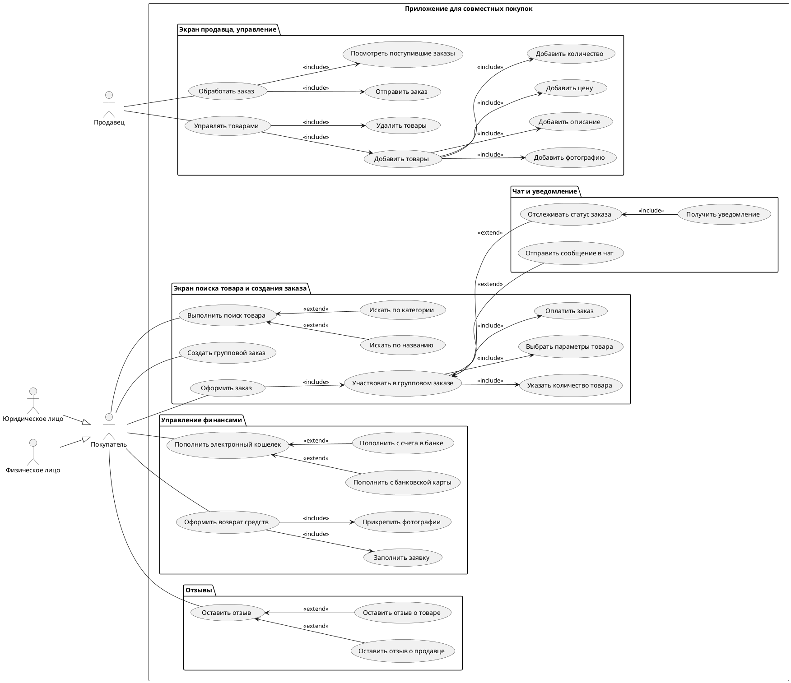

# Экраны приложения

## Описание алгоритма
Экраны клиента
1. ** Поиск товаров	/search	
Для фильтрации и сортировки товара: GET /api/products/search

2. ** Список товаров	/products	
Для получения списка товаров: GET /api/products

3. ** Добавление товара в корзину	/cart	
Для добавления товара в корзину: POST /api/cart/add

4. ** Участвовать в групповом заказе	/group-order	
Для участия в групповом заказе:
POST /api/group-order/join

5. ** Управление финансами	/wallet	
Для получения информации о электронном кошельке: GET /api/wallet
Для пополнения электронного кошелька: POST /api/wallet/recharge

6. ** Форма возврата средств	/api/wallet/refund	
Для оформления заявки возврат средств: POST /api/wallet/refund

7. ** Экран отзывов	/reviews	
Для получения отзывов о товаре: GET /api/reviews?productId={productId}
Для добавления отзыва: POST /api/reviews/add

8. ** Уведомление и чат	/chat	
Для получения сообщений чата:  GET /api/chat/messages
для отправки сообщения: POST /api/chat/send

Экраны продавца

9. **Обработка заказа(продавец)	/seller/orders	
Для получения списка заказов: GET /api/seller/orders
Для обновления статуса заказов: POST /api/seller/orders/update

10. **Управление складом	/inventory	
Для получения списка товаров на складе: GET /api/inventory
Для редактирования товара: POST /api/inventory/edit
Для удаления товара: DELETE /api/inventory/delete/{productId}
Для фильтрации и сортировки товаров: GET /api/inventory?filter={filter}&sort={sort}
Добавить новый товар	/inventory/add	Для добавления нового товара: POST /api/inventory/add