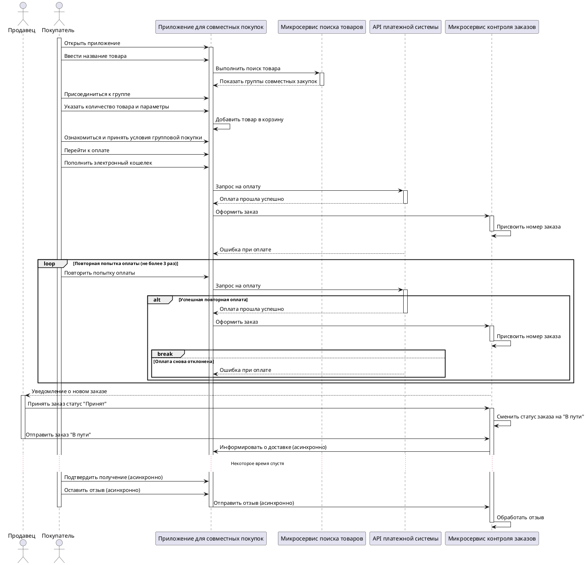

# Сценарий создания заказа и обработки

```plantuml

@startuml

actor "Продавец" as Seller

actor "Покупатель" as Buyer

participant "Приложение для совместных покупок" as App

participant "Микросервис поиска товаров" as ms1

participant "API платежной системы" as PaymentSystem

participant "Микросервис контроля заказов" as ms2

activate Buyer

Buyer -> App : Открыть приложение

activate App

Buyer -> App : Ввести название товара

App -> ms1: Выполнить поиск товара

activate ms1

App <-- ms1 : Показать группы совместных закупок

deactivate ms1

Buyer -> App : Присоединиться к группе

Buyer -> App : Указать количество товара и параметры

App -> App : Добавить товар в корзину

Buyer -> App : Ознакомиться и принять условия групповой покупки

Buyer -> App : Перейти к оплате

Buyer -> App : Пополнить электронный кошелек

alt Успешная оплата

App -> PaymentSystem : Запрос на оплату

activate PaymentSystem

App <-- PaymentSystem : Оплата прошла успешно

deactivate PaymentSystem

App -> ms2: Оформить заказ

activate ms2

ms2 -> ms2 : Присвоить номер заказа

deactivate ms2

else Оплата отклонена

App <-- PaymentSystem : Ошибка при оплате

deactivate PaymentSystem

loop Повторная попытка оплаты (не более 3 раз)

Buyer -> App : Повторить попытку оплаты

App -> PaymentSystem : Запрос на оплату

activate PaymentSystem

alt Успешная повторная оплата

App <-- PaymentSystem : Оплата прошла успешно

deactivate PaymentSystem

App -> ms2: Оформить заказ

activate ms2

ms2 -> ms2 : Присвоить номер заказа

deactivate ms2

break

else Оплата снова отклонена

App <-- PaymentSystem : Ошибка при оплате

deactivate PaymentSystem

end

end

end

ms2 --> Seller : Уведомление о новом заказе

activate Seller

Seller -> ms2 : Принять заказ статус "Принят"

activate ms2

ms2 -> ms2 : Сменить статус заказа на "В пути"

Seller -> ms2 : Отправить заказ "В пути"

deactivate Seller

App <- ms2: Информировать о доставке (асинхронно)

...Некоторое время спустя...

Buyer -> App : Подтвердить получение (асинхронно)

Buyer -> App : Оставить отзыв (асинхронно)

App -> ms2: Отправить отзыв (асинхронно)

deactivate Buyer

deactivate App

ms2 -> ms2 : Обработать отзыв

deactivate ms2

@enduml


```

## Описание алгоритма
